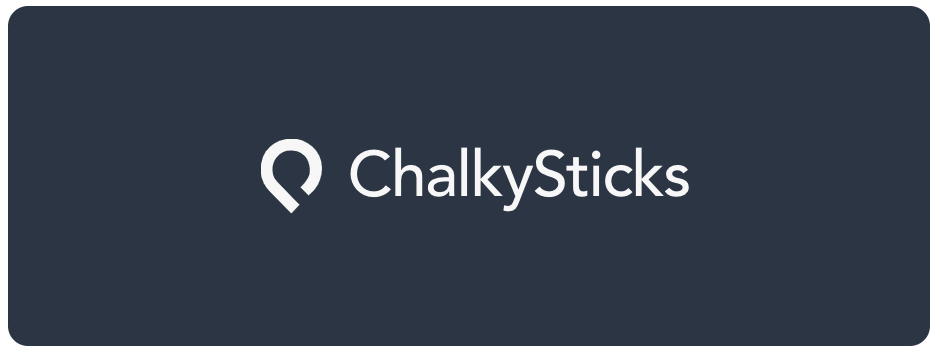

<p align="center">
    <a href="https://www.chalkysticks.com" target="_blank" rel="noopener noreferrer">
        
    </a>
</p>

<br/>

<p align="center">
    <a href="https://github.com/chalkysticks/sdk-core" title="GitHub version">
        
    </a>
    <a href="https://www.patreon.com/mattkenefick" title="Backers on Patreon">
        
    </a>
    <a href="https://paypal.me/polymermallard" title="Backers on Paypal">
        
    </a>
</p>

<br/>

## 🎱 SDK for web-based clients (core)

> Core SDK for web-based clients written in TypeScript offering base-level classes


## Installation

Open your terminal and type in

```sh
$ npm install -D @chalkysticks/core
```

Use them in your project by importing them

```typescript
import { CollectionBase, ModelBase, ... } from '@chalkysticks/core';
```

## Bugs

If you have questions, feature requests or a bug you want to report, please click [here](https://github.com/chalkysticks/sdk-core/issues) to file an issue.

## Support

Like what you see? Keep me awake at night by buying me a coffee or two.

<a href="https://www.patreon.com/mattkenefick" target="_blank">
    
</a>

## License

Copyright (c) 2021 Matt Kenefick.

Usage is provided under the MIT License. See [LICENSE](https://github.com/mattkenefick/eloquentjs/blob/master/LICENSE) for the full details.
